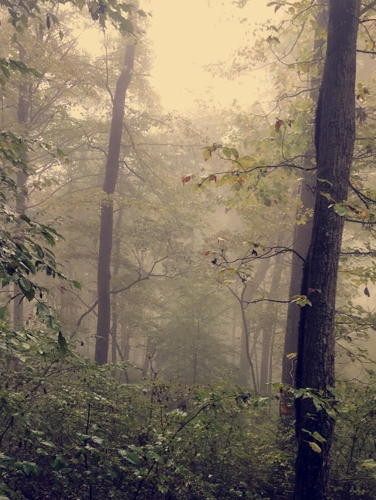
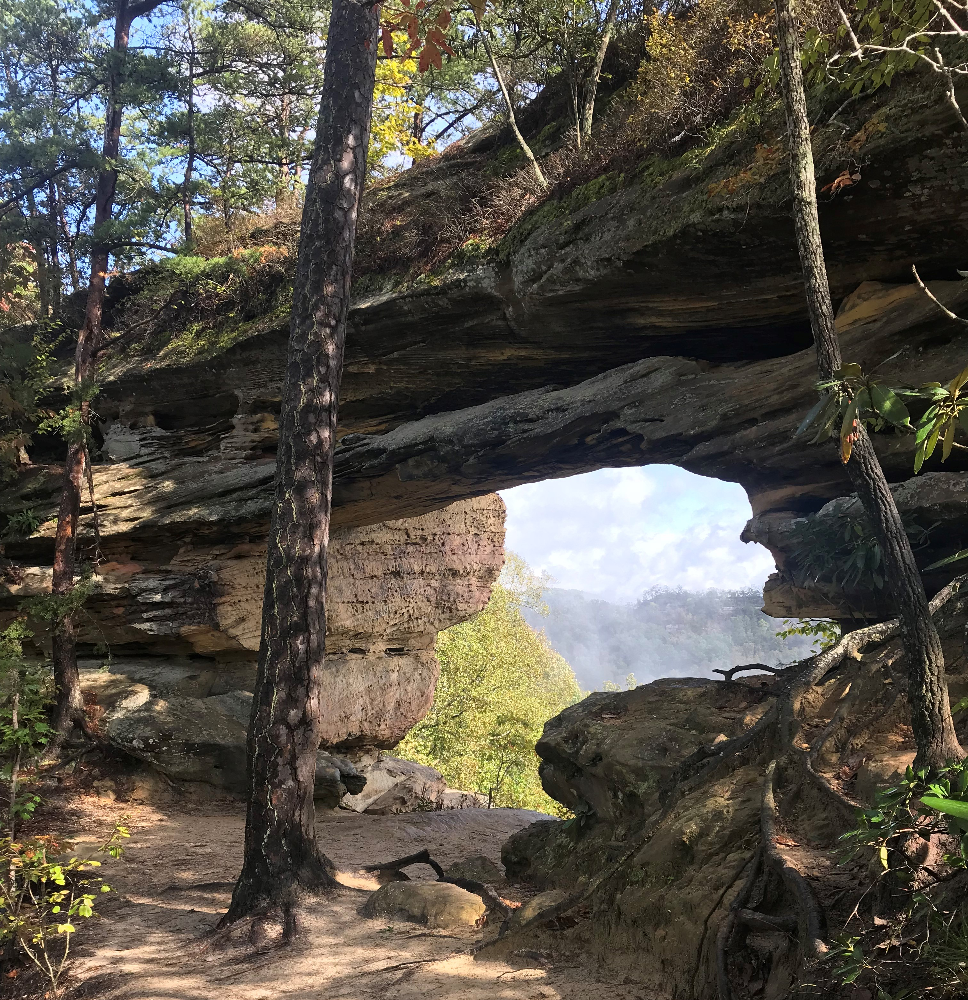
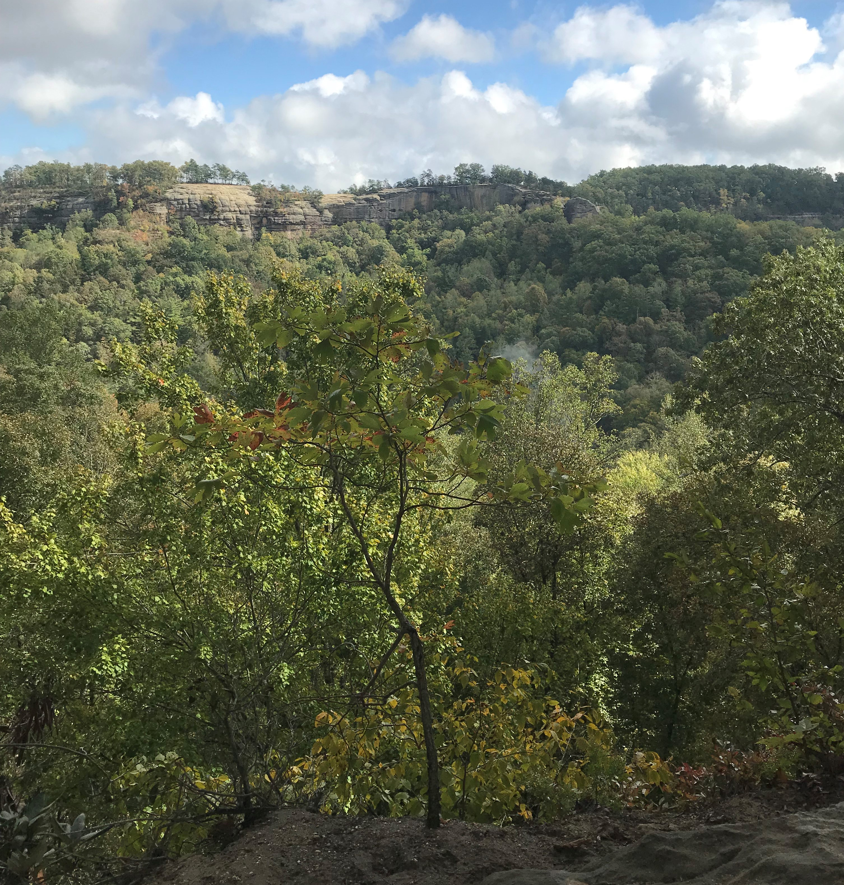
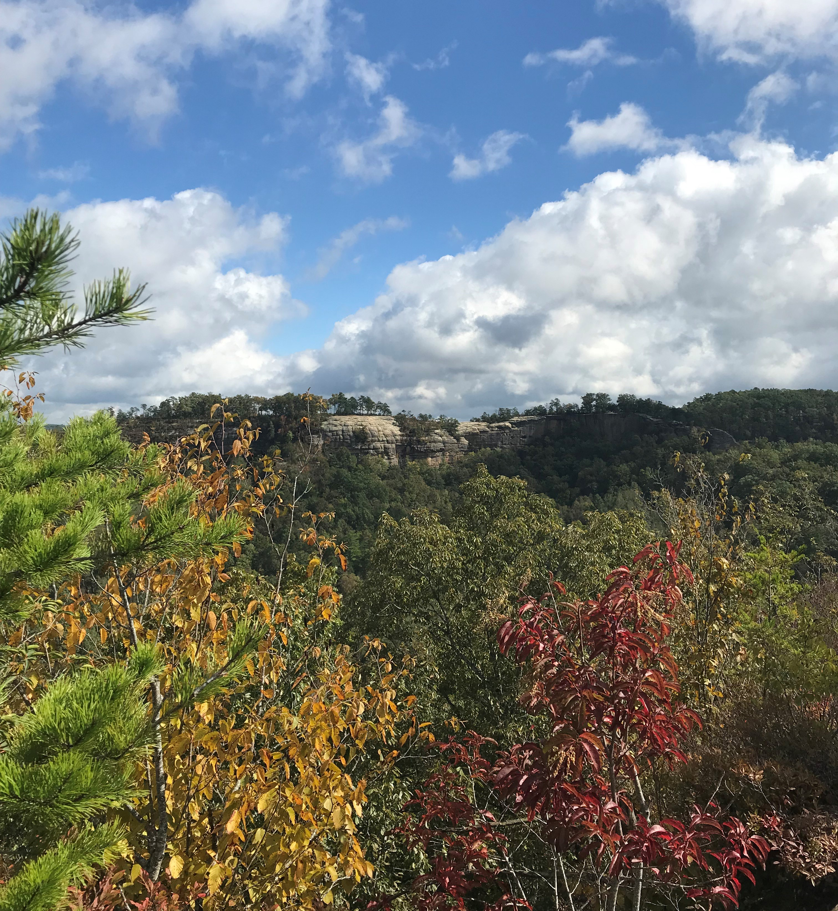

# FIELD REPORT
 by Hannah Johnson on October 20, 2018 in Red River Gorge

## Double Arch
 Tunnel Ridge Rd., Daniel Boone National Forest

 What separates the Double Arch from other sandstone arches in the Red River Gorge area? Well, just what the name suggests -- there are two arches all in one single landform! The hike, about 5 miles roundtrip from the trailhead, is unique with its natural beauty, a simple wooden bridge to cross a stream, and a few sets of wooden stairs to get up and down the steep hillsides.
 

The arch itself is probably no more than 18 feet tall and 30 feet long when you're looking at it from the side. Once on top of the arch, however, it feels as if the arch extends half the length of a football field. Using Avenza Maps to calculate the area of the entire landform, I would estimate it to be no more than 15,000 square feet. 

 The destination is the most breathtaking part. Not only is there a view from underneath the arch, but there are also natural steps in the side of the arch that lead you to the top. All of your worries are sure to go away as you look out across the horizon at this view.

The basemap in Avenza Maps seemed to be pretty accurate for the purpose I needed it for, which was tracking the coordinates and distance of my hike. I don't think it is very accurate in calculating anything specific to area. Adding elevation data would make the basemap I used in Avenza much more effective at showing accuracy when it came to tracking my hike. I would have liked to mark my elevation in certain spots to allow for better mapping in the lab later on.