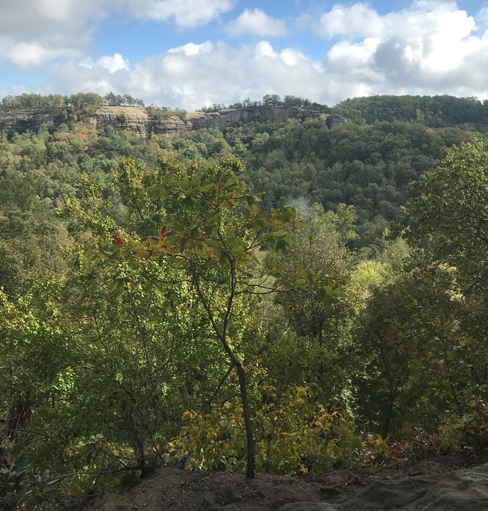

# rrg
 by Hannah Johnson, 2018 in Red River Gorge

## A project that explores Double Arch 
 Tunnel Ridge Rd., Daniel Boone National Forest

## Project assets

### Locator map

*(Source: lab 9)*

### Summary information 

What separates the Double Arch from other sandstone arches in the Red River Gorge area? Well, just what the name suggests -- there are two arches all in one single landform! The hike, about 5 miles roundtrip from the trailhead, is unique with its natural beauty, a simple wooden bridge to cross a stream, and a few sets of wooden stairs to get up and down the steep hillsides.

The arch itself is probably no more than 18 feet tall and 30 feet long when you're looking at it from the side. Once on top of the arch, however, it feels as if the arch extends half the length of a football field. Using Avenza Maps to calculate the area of the entire landform, I would estimate it to be no more than 15,000 square feet. 

*(Source: three paragraphs developed in labs 1, 5, and 9)*

### Bird's-eye view animation

* [video](https://youtu.be/KNF0ZVhHLkQ)

*(Source: one video made in lab 7)*

### Maps 

* [Base map of popular Red River Gorge arches](basemap/arches.pdf) *(lab 5)*
* [Cliffs over 40 feet](elevation/Lab7.jpg) *(lab 7)*

### Web pages 

* [Welcome to the Red River Gorge](../index.html) *(lab 1)*
* [Explore the arch](../map.html) *(lab 8)*

### Photographs

    
A Misty Morning Hike

     
Over the River and Through the Woods!

    
The Arch

    
From Down Under

    
Who knew a bare tree could look so amazing?

    
Panorama from on top of the Arch

*(Source: five photographs made in lab 5)*

## Final project 

For a super-polished version of final project, you should add content to your two web pages.

The lab 1 [Welcome to the Red River Gorge](../index.html) web page needs to have the following assets added:

* [Base map of popular Red River Gorge arches](basemap/arches.pdf) *(lab 5)*
* A link to the [Explore the arch](#) *(lab 8)* web page

The lab 8 [Explore the arch](#) *(lab 8)* web page needs to have the following assets added:

* [video](https://youtu.be/KNF0ZVhHLkQ) *(lab 7)*
* [Cliffs over 40 feet](elevation/Lab7.jpg) map *(lab 7)*
* Photographs *(lab 5)*
* Summary information/narrative about arch that includes measures of landform, e.g., height, width, etc. 